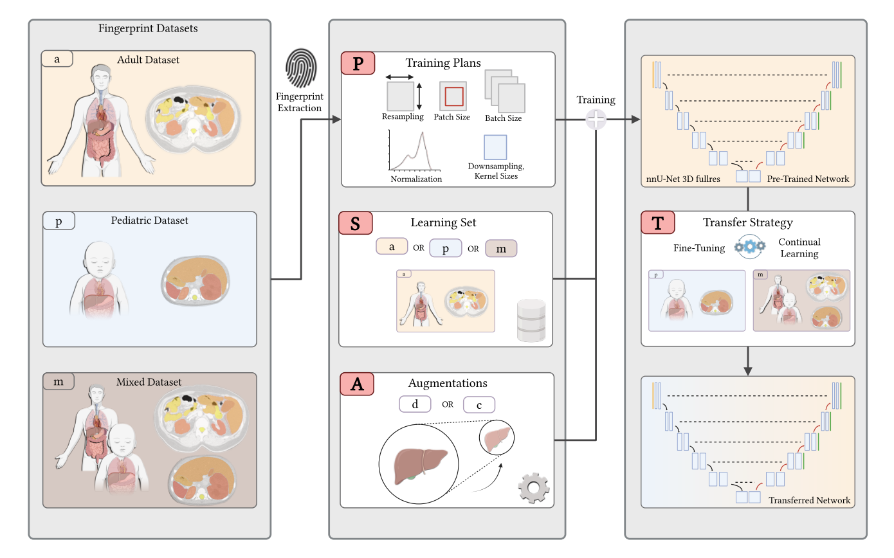

# PSAT

[](https://github.com/ICANS-Strasbourg/PSAT/actions/workflows/python-package.yml)

Pediatric Segmentation Approaches via Adult Augmentations and Transfer Learning

---

## Table of Contents
- [Overview](#overview)
- [Features](#features)
- [Citation](#citation)
- [Checkpoints & Pretrained Models](#checkpoints--pretrained-models)
- [Quickstart](#quickstart)
- [Usage](#usage)
- [Dependencies](#dependencies)
- [Documentation](#documentation)
- [Running Tests](#running-tests)
- [Contributing](#contributing)
- [License](#license)

---

## Overview

**PSAT** addresses pediatric segmentation challenges by leveraging adult, pediatric, and mixed datasets, advanced augmentation strategies, and transfer learning. It is designed for researchers and practitioners working on medical image segmentation, especially in pediatric contexts.



## Features
- **Flexible Training Plans:** Use adult, pediatric, or mixed data ($P_a$, $P_p$, $P_m$)
- **Customizable Learning Sets:** Adult-only, pediatric-only, or mixed ($S_a$, $S_p$, $S_m$)
- **Augmentation Strategies:** Default ($A_d$) and contraction-based ($A_c$)
- **Transfer Learning:** Direct inference ($T_o$), fine-tuning ($T_p$), continual learning ($T_m$)
- **Pretrained Models:** Ready-to-use checkpoints for nnU-Net
- **Evaluation Scripts:** For fast metrics computation

## Citation
If you use this code, please cite our paper:

```
@article{kirscher2025psat,
  title={PSAT: Pediatric Segmentation Approaches via Adult Augmentations and Transfer Learning},
  author={T. Kirscher et al},
  journal={MICCAI},
  year={2025},
  note={arXiv:xxxx.xxxxx}
}
```

This repository includes a `CITATION.cff` file for standardized citation metadata. You can also use the "Cite this repository" button on GitHub to obtain citation formats automatically.


## Checkpoints & Pretrained Models

We provide two model checkpoints for nnU-Net:
- **mixed_model_continual_learning.zip**
- **pure_pediatric_model.zip**

### Installing Pretrained Models

1. **Download Pretrained Weights:**
   - Go to the [GitHub Releases](https://github.com/ICANS-Strasbourg/PSAT/releases) page.
   - Download `mixed_model_continual_learning.zip` and `pure_pediatric_model.zip`.
   - Place them in `resources/checkpoints/`.

2. **Install the Checkpoint Using nnU-Net:**
   ```bash
   nnUNetv2_install_pretrained_model_from_zip resources/checkpoints/mixed_model_continual_learning.zip
   nnUNetv2_install_pretrained_model_from_zip resources/checkpoints/pure_pediatric_model.zip
   ```

3. **Run Inference:**
   After installing a checkpoint, run inference on your images:
   ```bash
   nnUNetv2_predict -i <input_images_dir> -o <output_dir> -d <dataset_id> -c <trainer_name> -f 0 -tr <task_name>
   ```
   Replace `<input_images_dir>`, `<output_dir>`, `<dataset_id>`, `<trainer_name>`, and `<task_name>` as appropriate. See [nnUNet documentation](https://github.com/MIC-DKFZ/nnUNet) for details.

For more details, see the [Resources](resources/resources.md) section.

## Quickstart

1. **Install dependencies:**
   ```bash
   pip install -r requirements.txt
   ```

2. **Evaluate Metrics (Example):**
   ```bash
   python scripts/compute_metrics.py <ground_truth_dir> <predictions_dir>
   ```
   Replace `<ground_truth_dir>` and `<predictions_dir>` with your folder paths containing NIfTI files.

## Usage

- **Preprocessing, Training, and Inference:**
  - See the [nnUNet documentation](https://github.com/MIC-DKFZ/nnUNet) and [nnUNet/nnUNet.md](nnUNet/nnUNet.md) for details on running full pipelines.
- **Scripts:**
  - Utility scripts are in the `scripts/` directory. See [scripts/scripts.md](scripts/scripts.md) for usage.

## Dependencies
- nibabel
- numpy
- pandas
- p_tqdm
- scipy
- surface-distance

(See `requirements.txt` for the full list.)

## Documentation

- [nnUNet](nnUNet/nnUNet.md)
- [Dataloading](nnUNet/dataloading/dataloading.md)
- [Preprocessing](nnUNet/preprocessing/preprocessing.md)
- [Training](nnUNet/training/training.md)
- [Resources](resources/resources.md)
- [Scripts](scripts/scripts.md)

## Running Tests

Install dependencies listed in `requirements.txt` and run:

```bash
pytest -q
```

## Contributing

Contributions are welcome! Please open issues or pull requests for bug fixes, improvements, or new features.

## License

This project is licensed under the MIT License. See [LICENSE](LICENSE) for details.
